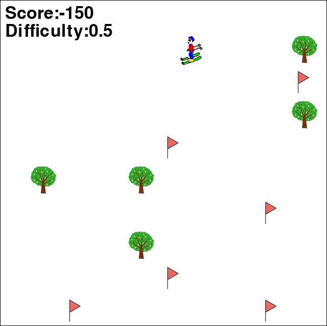

# EnvKnob



Project inspired from:

`Linus Gisslén, Andy Eakins, Camilo Gordillo, Joakim Bergdahl, and Konrad Tollmar. 2021. Adversarial Reinforcement Learning for Procedural Content Generation. In 2021 IEEE Conference
on Games (CoG). IEEE Press, 1–8. https://doi.org/10.1109/CoG52621.2021.9619053`

[Documentation with approach explained](docs/main.pdf)

[Presentation of the project](docs/AAS_project_discussion.pdf)

## Usage
To train 

```
python train.py --generator
```

To evaluate:
```
python eval.py --generator --load_path ./eval_expert/ --eval_difficulty 0 --load_solver_agent -1 --load_solver_agent -1
```

To play the demo. Move with left and right arrow keys and increase the difficulty with + or p an - or m. If you don't act for 100 steps the model loaded will be used
```
python play.py --generator --eval_difficulty 0 --load_path ./eval_expert/ --load_solver_agent -1 --load_generator_agent -1
```

The models are available at the following link:

https://drive.google.com/file/d/19Nydc1dhxV1qEhpSF9W4iTDQhREPK7dg/view?usp=sharing
